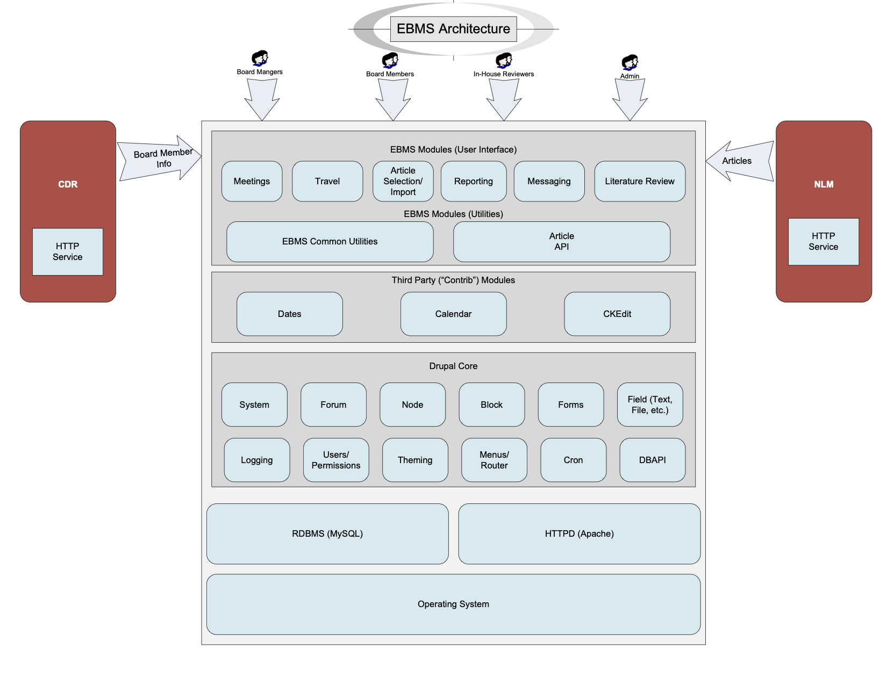

# EBMS

The EBMS (PDQ® Editorial Board Management System) is a portal for PDQ
board collaboration.  The site is built using Drupal 7 and runs on
CentOS 7 with Apache 2.4. Information on published scientific articles
is imported from the National Library of Medicine's PubMed.  In the
future the EBMS will invoke a service on the Central Data Repository
(CDR) to import information about the PDQ board members.

## About PDQ

The PDQ cancer information summaries are produced, maintained, and
updated regularly by six editorial boards comprised of oncology
specialists in fields including medical, surgical, and radiation
oncology; epidemiology; psychology; genetics; and complementary and
alternative medicine. Each Board reviews published research findings
on a monthly basis and meets several times a year to review and
discuss updates to their summaries. The Boards are not formal advisory
or policy-making boards for the NCI.

## Architectural Overview

This diagram provides a high-level view of the structure and
environment for the EBMS.

